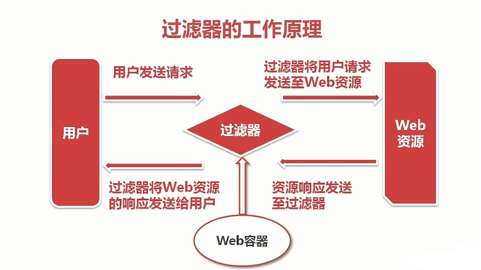
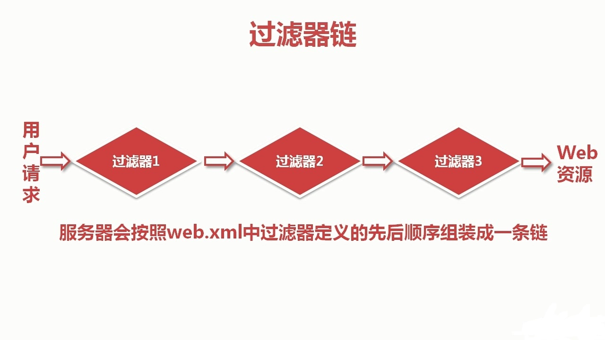
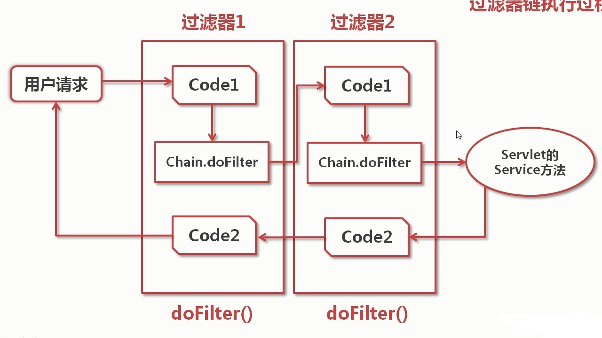
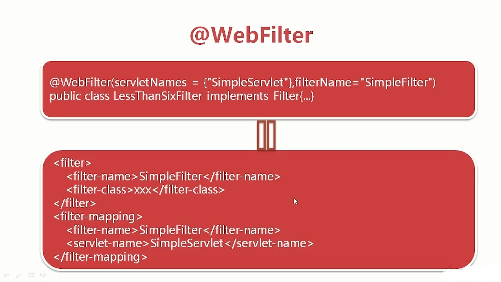
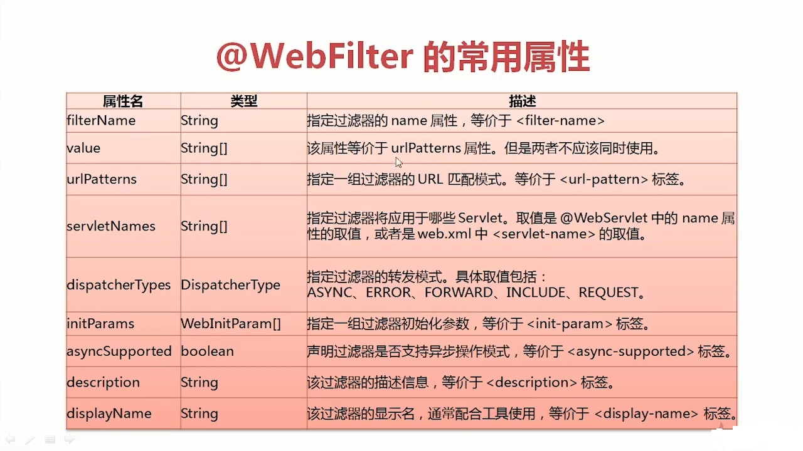

<!-- toc orderedList:0 depthFrom:1 depthTo:6 -->

* [过滤器组成](#过滤器组成)
* [过滤器的概念](#过滤器的概念)
* [过滤器的工作原理](#过滤器的工作原理)
* [过滤器的生命周期](#过滤器的生命周期)
* [web.xml的配置](#webxml的配置)
* [过滤器链](#过滤器链)
* [过滤器的分类](#过滤器的分类)
* [@WebFilter](#webfilter)

<!-- tocstop -->

## 过滤器组成
- 过滤源
- 过滤规则
- 过滤结果

过滤器用来过滤而不是处理用户请求

## 过滤器的概念

- 过滤器是一个服务器端的组件，它可以截取用户端的请求与响应信息，并对这些信息过滤。
- 过滤器能改变用户请求的Web资源，研究是改变用户请求的路径
- 不能直接返回是数据，不能直接处理用户请求。


## 过滤器的工作原理



## 过滤器的生命周期

1. 实例化--->`web.xml`（只会执行一次，在web容器启动时）
2. 初始化--->`init()`(只执行一次)
3. 过滤--->`doFilter()`
4. 销毁--->`destroy()`

- `init()`:这是过滤器的初始方法，Web容器创建过滤器实例后将调用这个方法。这个方法中可以读取`web.xml`文件。
- `doFilter()`:这个方法完成过滤操作。这个是过滤器的核心方法。当用户请求访问与过滤器关联的URL时，Web容器将先调用过滤器的`doFilter()`方法。`FilterChain`参数可以调用`chain.doFilter()`方法，将请求传给下一个过滤器（或目标资源），或利用转发，重定向将请求转发到其他资源。
- `destroy()`:Web容器在销毁过滤器实例前调用该方法，在这个方法中可以释放过滤器占用的资源（大多数情况用不到）。


## web.xml的配置

``` xml

<filter>
    <filter-name>Filter的名字</filter-name>
    <filter-class>Filter的类名称</filter-class> <!--（包含完整的包名）-->
    <description>描叙信息可以省略或者放在此位置</description>
    <init-param>
        <param-name>参数名称</param-name> <!--可以是零对或多对-->
        <param-value>参数值</param-value>
    </init-param>
</filter>

<filter-mapping>
    <filter-name>FirstFilter</filter-name> <!--当用户请求的URL和指定的URL匹配时将处罚过滤器工作-->
    <url-pattern>对应的URL</url-pattern>
    <dispatcher></dispatcher><!--可以是零对或多对，值为：REQUEST|INCLUDE|FORWARD|ERROR-->
</filter-mapping>

```
## 过滤器链

**过滤器链：**



**过滤器链的执行过程：**



1. 用户发请求，限制性过滤器1的code1部分,也就是过滤器1中`chain.doFilter()`前的代码部分，然后执行过滤器1的`doFilter()`。
2. 执行过滤器2的code1部分，然后再执行过滤器2的`doFilter()`。
3. 执行servlet的service方法,然后执行过滤器2的code2部分，也就是过滤器2中`chain.doFilter()`后的部分。然后执行过滤器1的code2部分。
4. 返回用户请求。


## 过滤器的分类

- Servlet2.5
  1. REQUEST (default)(用户直接访问页面时，Web容器会调用过滤器)
  2. FORWARD （目标资源通过RequstDispatcher的forward()访问时）
  3. INCLUDE （目标资源是用过RequestDispacher的include()方法调用时）
  4. ERROR  （目标资源是通过生命式异常处理机制调用时，过滤器将被调用）
- Servlet3.0
  1。ASYNC  （支持异步处理）

## @WebFilter  
此注解在3.0中加入
配置注解后，不需要再在web.xml中配置。注解在过滤器类名的前面。




---


