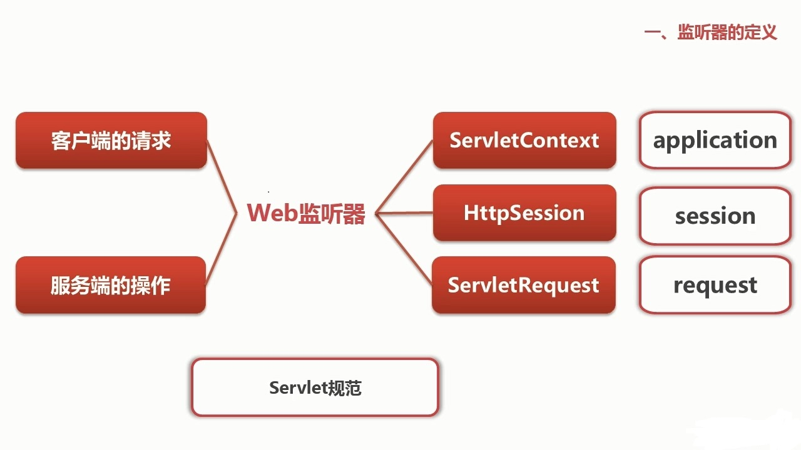

<!-- toc orderedList:0 depthFrom:1 depthTo:6 -->

* [监听流程](#监听流程)
* [Web监听器](#web监听器)
* [Web监听器的用途](#web监听器的用途)
* [创建Web监听器的步骤](#创建web监听器的步骤)
* [监听器的启动顺序](#监听器的启动顺序)
* [监听器的分类](#监听器的分类)
* [Session钝化机制](#session钝化机制)
* [Tomcat中的两种session钝化管理器](#tomcat中的两种session钝化管理器)
* [监听器接口的用途](#监听器接口的用途)
* [监听器在servlet3.0下的应用](#监听器在servlet30下的应用)

<!-- tocstop -->

## 监听流程
监听人--->监听设备--->被监听人

web应用服务器--->监听器--->Session

## Web监听器
- Servlet规范中定义的一种特殊类。
- 用于监听ServletContext、HttpSession和ServletRequest等域对象的创建与销毁事件。
- 用于监听域对象的属性发生修改的事件。
- 可以在事件发生前、发生后做一些必要的处理。

## Web监听器的用途

1. 统计在线人数和在线用户。
2. 系统启动时加载初始化信息。
3. 统计网站访问量。
4. 跟Spring结合。

## 创建Web监听器的步骤

1. 创建一个实现监听器接口的类。
2. 配置web.xml进行注册。

## 监听器的启动顺序

- 一个web.xml中多个监听器的话，按照在web.xml中注册的顺序来加载监听器。
-  如果有监听器，过滤器，和servlet的话。先加载监听器，然后是过滤器，最后是Servlet。

## 监听器的分类
- 按监听的对象划分：
  1. 监听应用程序环境对象ServletContext的事件监听器。
  2. 监听用户回话对象HttpSession的事件监听器。
  3. 监听请求消息对象的事件监听器。

- 按监听的事件划分：
  1. 监听域对象自身的创建和销毁的事件监听器：
       - ServletContext对应的SerlvetContextListener接口。
       - HttpSession对应的HttpSessionListener接口。
       - ServletRequest对应的ServletRequestListener接口。
  2. 监听域对象中属性的增加和删除的事件监听器：
       - ServletContext对应的SerlvetContextAttributeListener接口。
       - HttpSession对应的HttpSessionAttributeListener接口。
       - ServletRequest对应的ServletRequestAttributeListener接口。
  3. 监听绑定到HttpSession域中的某个对象的状态的事件监听器。  

HttpSession中的对象的4种状态：
- 绑定---解除绑定
- 钝化---活化

- 绑定其实就是保存，通过session.setAttribute()来实现，解除绑定通过session.removeAttribute()来实现。   
- 钝化是指将session对象持久化到一个存储设备上，而活化则是将session对象从一个存储设备上恢复。

对应的接口：
- HttpSessionBindingListener
  - 绑定：`valueBound()`方法。
  - 解除绑定：`valueUnBound()`方法。
- HttpSessionActivationListener
  - 钝化：`sessionWillPassivate()`方法。
  - 活化：`sessionDidActivate()`方法。
- **这两个监听器不需要再web.xml中注册**
- **而且创建的类并不是创建Listener类，而是创建普通的类javabean**，这个类实现上面的的两个接口，当然如果需要钝化的话，还需要实现Serializable接口。

## Session钝化机制

正常情况是session是放在服务器内存中的，服务器为每个用户创建一个sessioｎ对象。当在线用户很多的时候，session内存的开销会非常大，影响到服务器的性能。  
所以session钝化的本质在于把服务器中不经常使用的session对象暂时序列化到系统文件系统或是数据库系统中，当被使用时反序列化到内存中，整个过程由服务器自动完成。

## Tomcat中的两种session钝化管理器

session钝化及其由SessionManager管理,可以在tomcat安装目录中的conf文件夹中的context.xml中进行配置。

- `org.apache.catalina.session.StandardManager`
    - 当Tomcat服务器被关闭或重启时，tomcat服务器会将内存中的session对象钝化到服务器文件系统中。
    - 当Web应用程序被重新加载时，内存中的session对象也会被钝化到服务器的文件系统中。
    - 钝化后文件被保存在：Tomcat安装路径`/work/Catalina/hostname/applicationname/SESSION.ser`中。
- `org.apache.catalina.session.Persistentmanager`
    - 首先在钝化的基础上进行了扩张。第一种情况如上面1，第二种情况如上面2，第三种情况，可以配置主流内存的session对象数目，将不长使用的session对象保存到文件系统或数据库，需要时再重新加载。  
    - 默认情况下，Tomcat提供两个钝化驱动类，`org.apache.Catalina.FileStore`和`org.apache.Catalina.JDBCStore`。

## 监听器接口的用途

1. SerlvetContextListener:
    - 定时器
    - 加载全局属性对象
    - 创建全局的数据库链接
    - 加载一些缓存信息
2. HttpSessionListener:
    - 统计在线人数
    - 记录访问日志
3. ServletRequestListener：
    - 读取request参数
    - 记录访问历史

## 监听器在servlet3.0下的应用

使用servlet3.0的前提条件：
1. 使用servlet3.0新标准jar包。
2. JDK必须在1.6以上版本。
3. 编译器的编译级别为6.0。
4. 在web.xml文件中，使用3.0规范。
5. 使用支持servlet3.0特性的web容器，比如tomcat7。

`@WebListener`:  
该注解用于将类声明为监听器，被@WebListener标注的类必须实现以下至少一个接口：
ServletContextListener,ServletContextAttributeListener,SServletRequestListener,ServletRequestAttributeListener,HttpSessionListener,HttpSessionAttributeListener。
此时无法再去定义监听器的顺序，当然过滤器也是这样。
